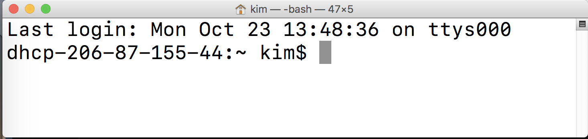
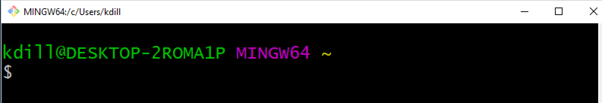
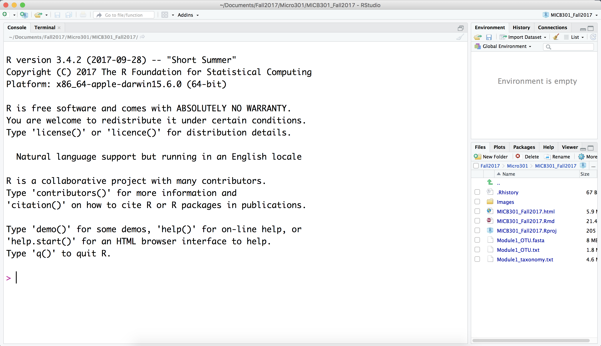
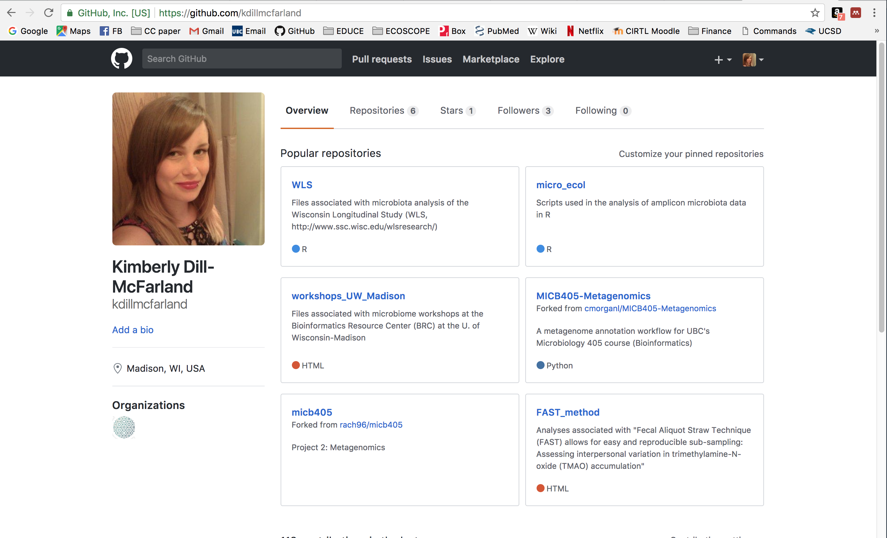

#Introduction
Prior to starting data science modules, you will need to download and install the following software as well as create a GitHub account. You must have administrator privileges on your machine to complete the installs.

#Command line
##Mac and Linux users
The native Mac and Linux command line terminals are sufficient for this course. You do not need to download anything additional. You can find this application by searching for 'terminal' in your Finder window. Open the Terminal.app and take a screenshot similar to Figure 1. You may also wish to add a shortcut to your Desktop or Dock.

##Windows users
The native Windows command line terminal does not work with the same syntax or language as Mac/Linux terminals. So, you will need to install software to create a Linux-based terminal on your Windows machine.

Download [Git](https://git-for-windows.github.io) using the `Git-2.15.1.2-**-bit.exe` where ** is 32 or 64 depending on what matches your operating system (OS). Install the software and open Git Bash (not CMD or GUI). Take a screenshot similar to Figure 2. You may also wish to add a shortcut to your Desktop or Start menu.

#RStudio
##R
Download and install [R](http://cran.stat.sfu.ca/) for your OS. If you already have R installed, please check that it is version 3.4.3 and update if necessary.

If your OS cannot support the latest version of R, please install the newest version possible and contact Dr. Dill-McFarland.

##RStudio GUI
After R is installed, download and install [RStudio](https://www.rstudio.com/products/rstudio/download/). Please use the FREE version and use the files under the 'Installers' section, not 'Zip/Tarballs/'.

Open RStudio and take a screenshot as in Figure 3.

#GitHub
Go to [GitHub](https://github.com/) and create a free account. Log-in to your homepage and take a screenshot like Figure 4, though your page will not have repositories yet.

#Troubleshooting
If installation occurred with no errors but a program will not open, try restarting your machine.

If you receive an error that says you cannot open the file because it is from an unknown source:

* Mac: right-click and choose 'Open With' --> 'Installer.app (default)' and choose 'Open' when prompted if you are sure you want to open the file
* Windows: right-click and choose ‘Run as administrator’

For further assistance, please attend an office hour or contact Dr. Dill-McFarland.

* Wed Jan 10 @ 10-11AM in LSI 1510
* Wed Jan 10 @ 2-3PM in LSI 1416
* Thurs Jan 11 @ 2-3PM in LSI 1416

#Assignment
After completion of the above, send a *single PDF* containing the relevant screenshots to Dr. Kim Dill-McFarland (kadm@mail.ubc.ca) **prior to the start of class on Friday, Jan. 12**.

\pagebreak

{width=50%}

{width=50%}

{width=50%}

{width=50%}